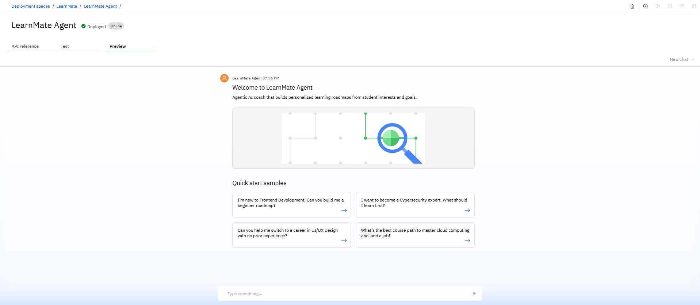
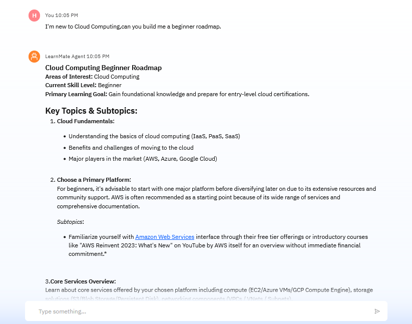

# LearnMate – Agentic AI for Personalized Course Pathways 🎓🤖

LearnMate is an Agentic AI Coach built using IBM Watsonx.ai that helps students create personalized learning roadmaps based on their interests, skill level, and career goals. It dynamically adapts to user input and can ground responses using uploaded curriculum documents (PDF, DOCX, TXT).

> 🚀 Built for IBM Skillbuild | IBM Cloud Lite + Watsonx + Granite + Vector Index

---

## 📌 Problem Statement

Students often struggle to identify the right learning path due to the overwhelming number of online courses and lack of personalized guidance.

LearnMate solves this by:
- Interacting with users via natural language
- Collecting interests, skill level, and learning goals
- Generating dynamic, personalized course roadmaps
- Optionally grounding responses using uploaded documents

---

## 🛠️ Technologies Used

- IBM Watsonx.ai Studio Lite
- IBM Granite LLM (Granite-13b-instruct)
- IBM Agent Lab (LangGraph + ReAct)
- Vector Indexing (TXT/PDF grounding)
- Prompt Engineering (no-code tasks)
- GitHub (project hosting)

---

## ⚙️ Features

- ✅ Personalized roadmap generation
- ✅ Real-time input collection via Agent chat
- ✅ Vector-based grounding from `.txt`, `.pdf`, `.docx`
- ✅ Output includes roadmap, timeline, and course links
- ✅ IBM-native deployment with no-code workflows

---

## 📸 Screenshots

### 🔹 LearnMate Agent UI (Watsonx Preview)



---

### 🔹 Example: Cloud Computing Beginner Roadmap



---

## 🧱 Project Structure
```
LearnMate-Agentic-AI/
├── assets/ # Screenshots
│ ├── chat_ui.png
│ └── roadmap_output.png
├── grounding/ # Grounding files for vector index
│ └── learnmate.txt
├── docs/ # Optional PDF/Docx content
├── README.md
```

---

## 🧪 How It Works

1. User is welcomed by LearnMate Agent.
2. Agent asks for:
   - Interests (e.g., Frontend, Cybersecurity)
   - Skill level (Beginner/Intermediate)
   - Learning goal (Job, Portfolio, Certification)
3. Agent generates roadmap using Granite LLM.
4. If documents are uploaded, vector index is queried for accuracy.
5. Agent displays structured course roadmap with topic breakdown and recommendations.

---

## 🔗 GitHub Deployment

📂 Repo: [github.com/harshit27p/LearnMate-Agentic-AI](https://github.com/harshit27p/LearnMate-Agentic-AI)

📎 Includes:
- Prompt template used for roadmap generation
- Vector index setup guide
- Sample `.txt` file for grounding (frontend, cloud, cybersecurity)
- Screenshots of agent and roadmap

---

## 🔮 Future Scope

- 📈 Progress tracking with Object Storage
- 🌍 Multilingual support
- 🔊 Voice-interactive agent
- 🎓 LMS integration for universities
- 📱 Mobile-first deployment

---

## 🎓 IBM Certifications

- Getting Started with AI (Credly)
- Journey to Cloud (Credly)
- Retrieval Augmented Generation (RAG Lab)

---

## 🙏 Thank You

Built by **Harshit Prajapati**  
B.Tech CSE, Arya Institute of Engineering & Technology

> ✨ Let’s empower learners with personalized AI-driven guidance!
